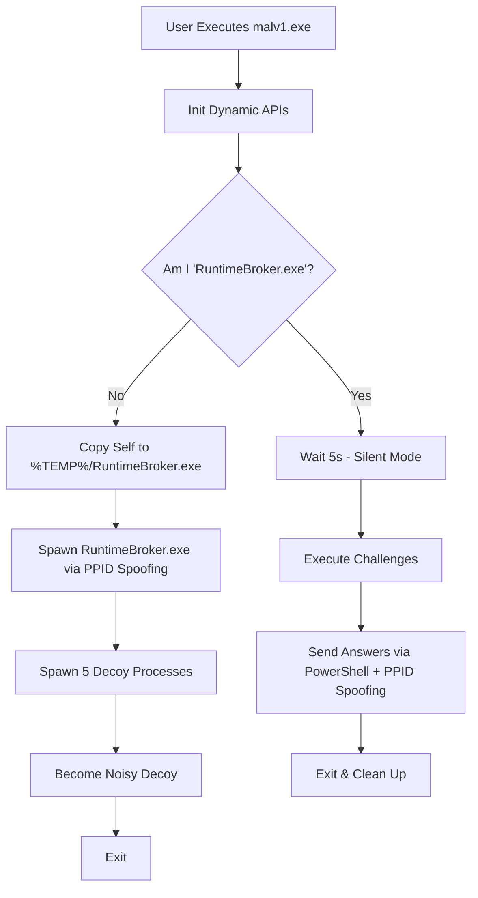

# AIS BOMBE - [NTNU]\_[乾脆就填"想不到隊名"]

Advanced Information Security Final Project — Red/Blue Team CTF Exercise

> Platform: https://academy.bombe.top/
> Docs: https://docs.bombe.top/

## Team

| Member | Student ID | Role |
|--------|-----------|------|
| 蕭宣昱 | 61447027S | EDR Challenges + EDR Ranking |
| 黃奕喆 | 61447099S | EDR Challenges |
| 黃以謙 | 41143203S | Malware Ranking |
| 李家維 | 61347001S | Environment Setup + Malware Challenges |

## Project Structure

```
BOMBE/
├── malv1/                  # Malware (Red Team)
│   ├── Program.cs          # Core malware implementation
│   ├── malv1.csproj        # .NET 6.0 project config
│   └── malv1.crproj        # ConfuserEx obfuscation config
├── edrv1/                  # EDR (Blue Team)
│   ├── Program.cs          # ETW-based detection engine
│   └── edrv1.csproj        # .NET 6.0 project config
├── HTTPS Server/           # Local test server
│   ├── Setup-Https.ps1     # Self-signed cert + hosts setup
│   ├── Start-Https-Server.ps1  # HTTPS listener
│   └── CleanUp.ps1         # Teardown script
└── Present/                # Final presentation materials
    ├── *.pptx              # Slides
    ├── *_ppt.pdf           # Slides (PDF export)
    └── *_Write Up.pdf      # Written report
```

## Tech Stack

- **Runtime**: .NET 6.0 | C# | win-x64
- **Dependencies**: `Newtonsoft.Json`, `System.Data.SQLite` (malv1), `Microsoft.Diagnostics.Tracing.TraceEvent` (edrv1)

## Red Team — Malware (`malv1`)

### Challenge Solutions

| Challenge | Target | Technique |
|-----------|--------|-----------|
| Q1 Registry | `HKLM\SOFTWARE\BOMBE\answer_1` | Direct registry read |
| Q2 SQLite + AES | `bhrome\Login Data` | cmd.exe file copy (LotL) + AES-CBC decrypt |
| Q3 Memory Scan | `bsass.exe` process memory | `VirtualQueryEx` + `ReadProcessMemory` + regex match |

### Ranking Evasion Techniques

**Static Analysis Evasion**
- **String Encryption** — XOR + Base64 obfuscation for all sensitive strings
- **IAT Hiding** — Dynamic API resolution via `LoadLibrary` / `GetProcAddress`

**Dynamic Analysis Evasion**
- **PPID Spoofing** — Fake parent process as `explorer.exe` to break process tree tracing
- **Hide POST Request** — PowerShell proxy execution (LOLBins) for C2 communication
- **Decoy Spawning** — Multiple fake `BOMBE_EDR_FLAG_*.exe` processes as noise; real payload runs as `RuntimeBroker.exe`

### Malware Execution Flow



## Blue Team — EDR (`edrv1`)

### Detection Strategy

| Layer | Method | Detail |
|-------|--------|--------|
| File I/O | ETW `KernelTraceEventParser` | Monitor access to `bhrome\Login Data`, trace parent process chain up to 16 levels |
| Network | ETW TCP monitoring | Detect HTTPS (port 443) outbound connections from suspicious processes |

### Detection Flow

1. Subscribe to ETW kernel events (Process, FileIO, NetworkTCPIP)
2. Maintain PID → EXE name and PID → Parent PID mapping tables
3. On file access to target path → walk ancestor chain → match `BOMBE_EDR_FLAG_*` pattern
4. On TCP connect to port 443 → walk ancestor chain → identify malware process
5. Submit detected malware name to `https://submit.bombe.top/submitEdrAns`

## Build & Run

```bash
# Build (via Visual Studio)
Build > Publish Selection > Publish

# Local testing
cd "HTTPS Server"
powershell -ExecutionPolicy Bypass -File Setup-Https.ps1
powershell -ExecutionPolicy Bypass -File Start-Https-Server.ps1
```

## License

Course project for Advanced Information Security, NTNU. Not for production use.
